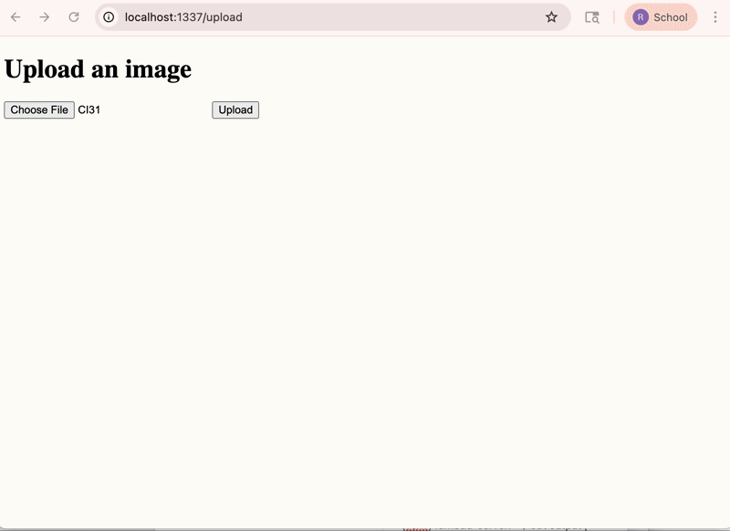

# flask-on-docker


## Overview

This repository contains a fully Dockerized Flask web application deployed with PostgreSQL, Gunicorn, and Nginx. The project demonstrates a production-ready container architecture, including separate development and production configurations, reverse proxy routing, database persistence, file upload handling, and automated CI validation via GitHub Actions. The application supports image uploads and serves media files through a structured Docker stack.


## Demo


The demo shows:

- Starting the production stack
- Navigating to the upload page
- Uploading an image
- Viewing the image served from /media/<filename>

## Tech Stack

- Flask – Web framework
- PostgreSQL – Database
- Gunicorn – Production WSGI server
- Nginx – Reverse proxy
- Docker & Docker Compose – Container orchestration
- GitHub Actions – Continuous Integration

## Development Setup

Build and run the development stack:

```
docker compose up --build
```

The development server will be available at:

```
http://localhost:5001
```


To stop:

```
docker compose down -v
```

## Production Setup

Build and run the production stack:

```
docker compose -f docker-compose.prod.yml up -d --build
```

The production application is available at:

```
http://localhost:1337
```

To stop:

```
docker compose -f docker-compose.prod.yml down -v
```

## CI Pipeline

A GitHub Actions workflow automatically:

- Builds the development Docker stack
- Starts services
- Performs a smoke test via curl
- Shuts down containers
- The CI badge above confirms the stack builds successfully in development.
